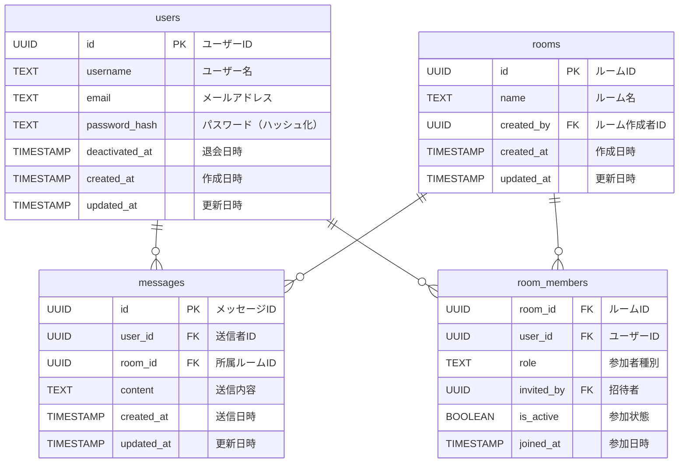

# DB設計

最小構成



## users（ユーザー）テーブル 
ユーザー情報を管理するテーブル。
```sql
CREATE TABLE users (
  id SERIAL PRIMARY KEY,
  username TEXT NOT NULL UNIQUE,  -- ユーザー名
  email TEXT UNIQUE,  -- メールアドレス
  password_hash TEXT,  -- パスワード（ハッシュ化）
  deactivated_at TIMESTAMP,  -- 退会日時
  created_at TIMESTAMP DEFAULT CURRENT_TIMESTAMP,  -- 作成日時
  updated_at TIMESTAMP DEFAULT CURRENT_TIMESTAMP   -- 最終更新日時
);
```

## messages（メッセージ）テーブル
メッセージ送信と受信を管理するテーブル。
```sql
CREATE TABLE messages (
  id SERIAL PRIMARY KEY,
  user_id INTEGER REFERENCES users(id),  -- 送信者者ID
  room_id INTEGER REFERENCES rooms(id),  -- ルームID
  content TEXT,  -- 送信内容
  created_at TIMESTAMP DEFAULT CURRENT_TIMESTAMP,  -- 送信日時
  updated_at TIMESTAMP DEFAULT CURRENT_TIMESTAMP   -- 更新日時
);
```
## rooms（ルーム）テーブル
チャットルームに関する基本的な情報を管理するテーブル。
```sql
CREATE TABLE rooms (
  id SERIAL PRIMARY KEY,
  name TEXT NOT NULL,  -- ルーム名
  created_by INTEGER REFERENCES users(id),  -- ルーム作成者者ID
  visibility TEXT DEFAULT 'public',  -- ルーム公開設定
  created_at TIMESTAMP DEFAULT CURRENT_TIMESTAMP,  -- 作成日時
  updated_at TIMESTAMP DEFAULT CURRENT_TIMESTAMP   -- 更新日時
);
```

## room_members（ルームメンバー）テーブル
ユーザーとルームの多対多のリレーションを管理するテーブル。
```sql
CREATE TABLE room_members (
  room_id INTEGER REFERENCES rooms(id),  -- ルームID
  user_id INTEGER REFERENCES users(id),  -- ユーザーID
  role TEXT DEFAULT 'member',  -- 役割（管理者、メンバー、ゲストなど）
  invited_by INTEGER REFERENCES users(id), -- 招待者
  is_active BOOLEAN DEFAULT TRUE,  -- ルーム参加状態
  joined_at TIMESTAMP DEFAULT CURRENT_TIMESTAMP,  -- 参加日時
  PRIMARY KEY (room_id, user_id)  -- ルームへの重複参加防止
);
```


---
将来的に追加想定

## authentications（認証）テーブル
ユーザーの認証情報を管理するテーブル。
```sql
CREATE TABLE authentications (
  id SERIAL PRIMARY KEY, 
  user_id INTEGER REFERENCES users(id),  -- ユーザーID
  provider TEXT NOT NULL,  -- 認証方式の識別
  provider_user_id TEXT NOT NULL,  -- 外部認証サービスのユーザーID
  token TEXT,  -- 認証用トークン
  created_at TIMESTAMP DEFAULT CURRENT_TIMESTAMP,  -- 認証情報の作成日時
  updated_at TIMESTAMP DEFAULT CURRENT_TIMESTAMP   -- 認証情報の更新日時
);
```

## message_likes（いいね）テーブル
ユーザーがメッセージに対して「いいね！」をする機能に対応するテーブル。
```sql
CREATE TABLE likes (
  id SERIAL PRIMARY KEY,
  user_id INTEGER REFERENCES users(id),  -- いいねをしたユーザーのID
  message_id INTEGER REFERENCES messages(id),  -- いいねが付けられたメッセージID
  is_active BOOLEAN DEFAULT TRUE,  -- いいねが有効かどうか
  created_at TIMESTAMP DEFAULT CURRENT_TIMESTAMP  -- いいねを付けた日時
);
```

## message_read（既読）テーブル
メッセージの既読状態を管理するテーブル。
```sql
CREATE TABLE read_receipts (
  id SERIAL PRIMARY KEY,
  message_id INTEGER REFERENCES messages(id),  -- メッセージID
  user_id INTEGER REFERENCES users(id),  -- 既読をつけたユーザーのID
  is_read BOOLEAN DEFAULT TRUE,  -- 既読状態
);
```

## message_mentions（メンション）テーブル
メッセージ内でユーザーがメンションされた情報を管理するテーブル。
```sql
CREATE TABLE mentions (
  id SERIAL PRIMARY KEY,
  message_id INTEGER REFERENCES messages(id),  -- メッセージID
  mentioned_user_id INTEGER REFERENCES users(id),  -- メンションされたユーザーのID
);
```

## notifications（通知）テーブル
通知機能に対応するテーブル。
```sql
CREATE TABLE notifications (
  id SERIAL PRIMARY KEY,
  user_id INTEGER REFERENCES users(id),  -- 通知を受け取るユーザーID
  message_id INTEGER REFERENCES messages(id),  -- 通知対象メッセージ
  target_user_id INTEGER REFERENCES users(id),  -- 通知対象ユーザー（フォロー時）
  notification_type TEXT,  -- 通知内容（メッセージ、いいね、メンション、フォロー）
  is_read BOOLEAN DEFAULT FALSE,  -- 既読状態
  created_at TIMESTAMP DEFAULT CURRENT_TIMESTAMP  -- 通知作成日時
);
```

## follows（フォロー）テーブル
ユーザー同士がフォローする機能に対応するテーブル。
```sql
CREATE TABLE follows (
  follower_id INTEGER REFERENCES users(id),  -- フォローするユーザー
  followed_id INTEGER REFERENCES users(id),  -- フォローされるユーザー
  created_at TIMESTAMP DEFAULT CURRENT_TIMESTAMP, --フォロー日時
  PRIMARY KEY (follower_id, followed_id)  -- 重複フォロー防止
);
```

## profiles（プロフィール）テーブル
ユーザーのプロフィール情報を管理するテーブル。
```sql
CREATE TABLE profiles (
  id SERIAL PRIMARY KEY,
  user_id INTEGER REFERENCES users(id),  -- ユーザーID
  bio TEXT,  -- 自己紹介文
  profile_picture_url TEXT,  -- プロフィール画像のURL
  created_at TIMESTAMP DEFAULT CURRENT_TIMESTAMP,  -- 作成日時
  updated_at TIMESTAMP DEFAULT CURRENT_TIMESTAMP   -- 更新日時
);
```

## room_visibility（ルーム公開設定）テーブル
```sql
CREATE TABLE room_visibility (
  visibility_id SERIAL PRIMARY KEY,
  room_id UUID REFERENCES rooms(id),  -- ルームID
  visibility TEXT DEFAULT 'public' NOT NULL,  -- 公開設定
  created_at TIMESTAMP DEFAULT CURRENT_TIMESTAMP,  -- 作成日時
  updated_at TIMESTAMP DEFAULT CURRENT_TIMESTAMP   -- 更新日時
);
```

## message_images（メッセージ画像）テーブル 
```
CREATE TABLE images (
  id SERIAL PRIMARY KEY,
  user_id INTEGER REFERENCES users(id),  -- ユーザーID
  message_id INTEGER REFERENCES messages(id),  -- メッセージID
  image_url TEXT,  -- 画像のURL
  created_at TIMESTAMP DEFAULT CURRENT_TIMESTAMP,  -- 画像のアップロード日時
  updated_at TIMESTAMP DEFAULT CURRENT_TIMESTAMP   -- 画像の更新日時
);

```
